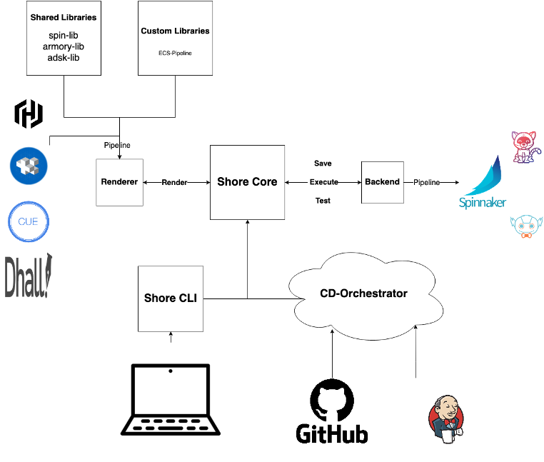

# Shore Architecture

## Preface

This document contains a high-level overview of the terms & technologies in the `Shore` project.

### Documents intentions

1. Illustrate the project's architecture
2. Explaining how the requirement described in the [Product Requirements Document](./PRD.md) are implemented.
3. Provide an overview for future contributors.

### What to keep in mind while reading

1. Shore is a `Framework`.
2. Shore is a `project` based software.
3. Shore is built to be extensible.

## High Level Architecture Diagram
<!-- TODO: Add a flow-chart -->
<!-- TODO: Add a better diagram -->
<!-- markdownlint-disable no-inline-html -->

    

<!-- markdownlint-enable no-inline-html -->

## Core Architecture Docs

### [Shore Core](./docs/internal/architecture/shore-core.md)

A codified boundary, used to differentiate the systems core components.

For more infromation please see [`shore-core`](./docs/internal/architecture/shore-core.md)

### [Shore CLI](./docs/internal/architecture/shore-cli.md)

An interface that expose `shore-core` through a [`cli`](https://en.wikipedia.org/wiki/Command-line_interface)

For more infromation please see [`shore-cli`](./docs/internal/architecture/shore-cli.md)

## Renderers

1. [Jsonnet Renderer](./docs/internal/architecture/renderers/jsonnet.md) - A `Shore Renderer` reference implementation that uses `Jsonnet`
NOTE: If you'd like to "bring your own" pipeline and leverage Shore's testing, saving, and executing capabilities, please follow the [bring your own pipeline tutorial](https://github.com/Autodesk/shore-tutorials/tree/master/tutorials/bring-your-own-pipeline).
## Backends

1. [Spinnaker Backend](./docs/internal/architecture/backends/spinnaker.md) - A `Shore Backend` reference implementation that integrates with `Spinnaker`
