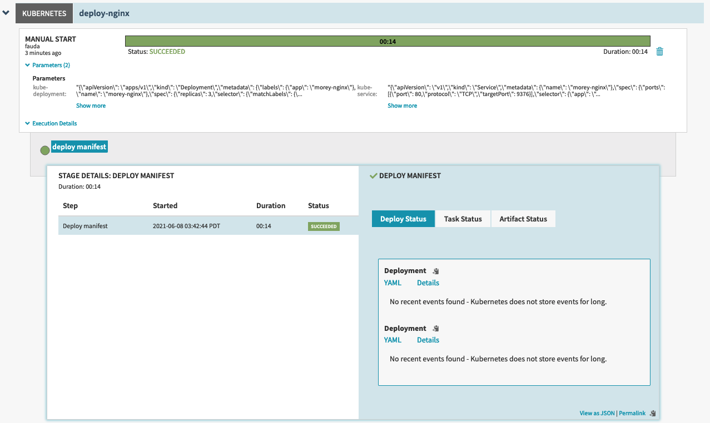
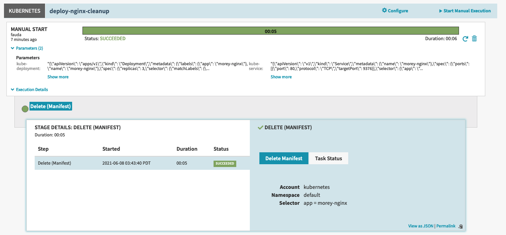

# Clean-up pipeline

## Context

This example shows the use of the shore `cleanup` feature.

`shore cleanup ${}` commands are used to implement `cleanup` operations, or in other words, reversing the operations that were implemented by the pipeline.

## How to run

### Tools Required

1. Shore (Duh!)
2. jsonnet-bundler

### Testing the setup

```bash
jb install
shore render
shore save
shore exec

shore cleanup render
shore cleanup save
shore cleanup exec
```

## Results

### Results of `shore render/save/exec` - `main.pipeline.jsonnet`



### Results of `shore cleanup render/save/exec` - `main.pipeline.jsonnet`


