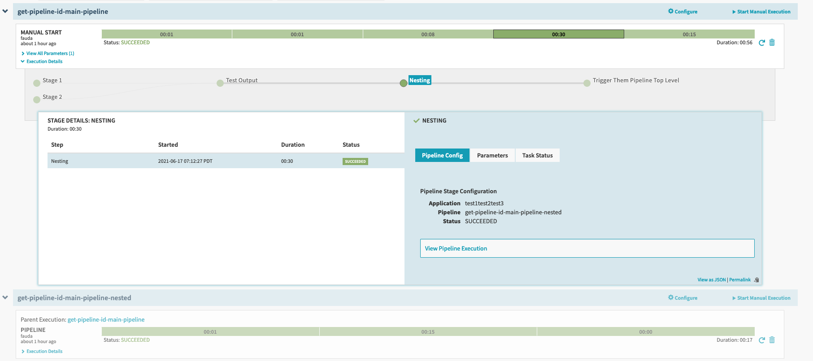
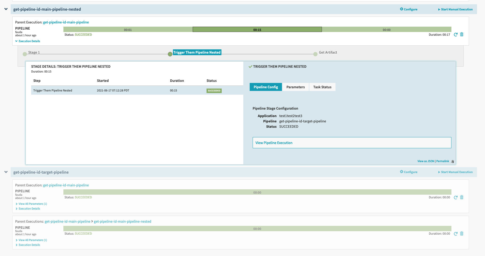
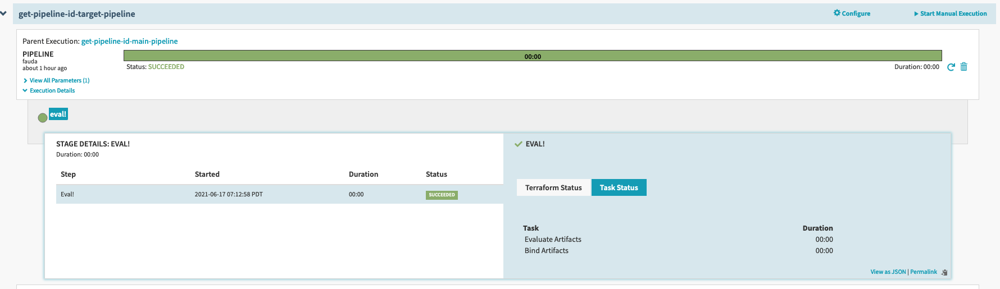
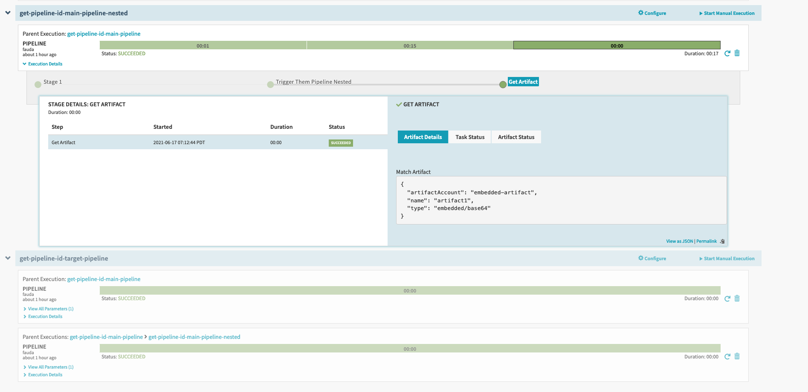
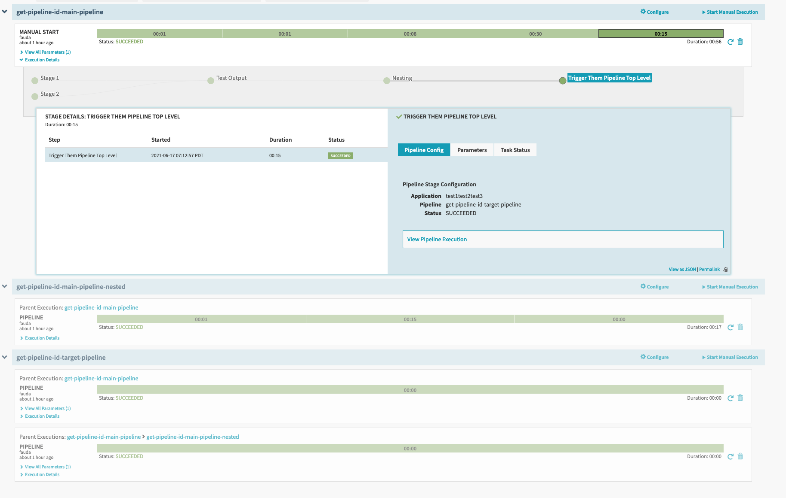
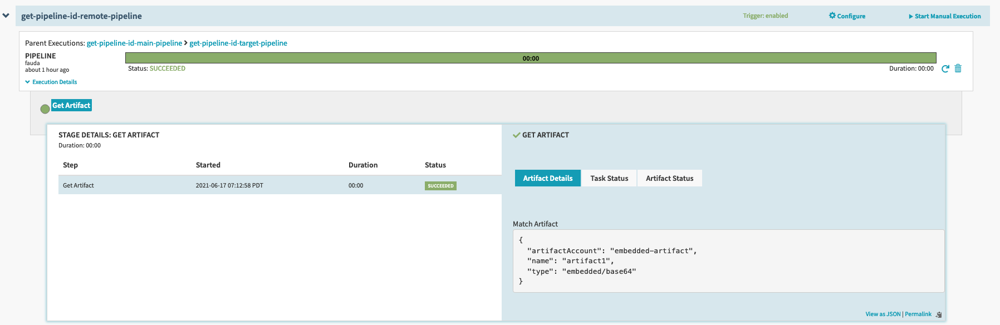
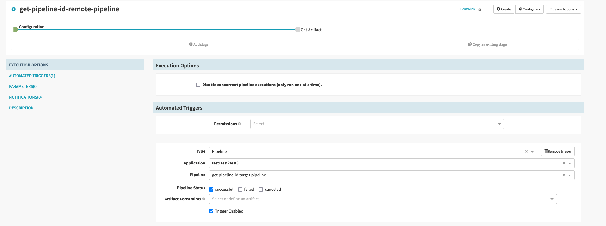

# Get Pipeline ID

This example shows how to invoke and get remote Pipeline IDs defined as an `application/pipeline` properties.

The example is complex by testing multiple scenarios:

* `main-pipeline`:
  * Remote Pipeline Execution stage
  * Create a nested pipeline stage with:
    * Remote Pipeline Execution stage
    * Resolve Artifact From Pipeline
* `target-pipeline`:
  * Evaluate Artifact
* `remote-pipeline`:
  * Trigger Pipeline on success of `main-pipeline`.
  * Resolve Artifact From Pipeline

## Explaining The Example

### Main Invokes The Nested Pipeline

### Nested Pipeline Invokes `get-pipeline-id-target-pipeline`

### `get-pipeline-id-target-pipeline` evaluates a new artifact

### Nested Pipeline Retrieves the evaluated artifact from `get-pipeline-id-target-pipeline`

### Main Pipeline Invokes `get-pipeline-id-target-pipeline` (show top level invocation works as well)

### `get-pipeline-id-remote-pipeline` is invoked via Spinnaker when `get-pipeline-id-main-pipeline` ends successfully

### `get-pipeline-id-remote-pipeline` configuration

