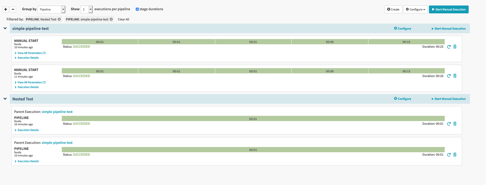
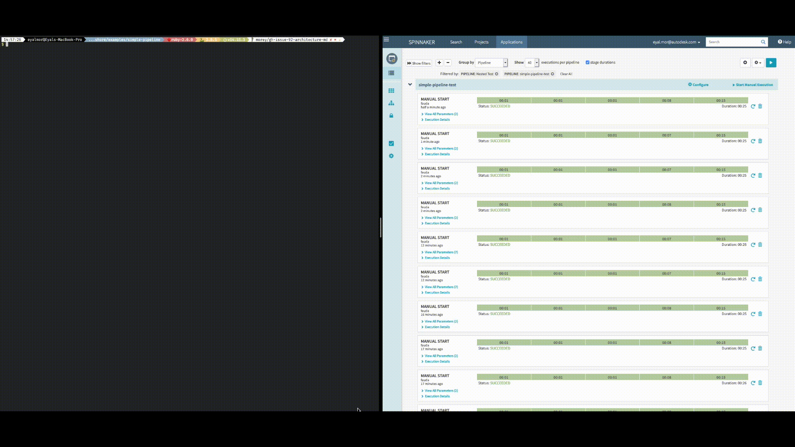

# Simple Pipeline

## Context

The "Simple Pipeline" - `Shore Project` example is intended for demonstration and testing purposes.

For installation instructions and `shore` specific concepts, please consult the [`shore tutorials`](https://github.com/Autodeskshore-tutorials)

## Features Demonstrated (and tested)

1. Declarative Pipeline definitions.
2. Automatic Stage references.
3. Easy nesting of pipelines.
4. E2E testing examples.

## How to run

### Tools Required

1. Shore (Duh!)
2. jsonnet-bundler

### Testing the setup

```bash
jb install
shore render
```

### Saving the pipeline

> Validate that the `render.yaml` file has an `application` name you want to use.

You will need to have a working `~/.spin/config` (AKA `spin-config`) file to be able to connect to Spinnaker, and a Spinnaker cluster.

Than run:

```bash
shore save
```

When the commands ends (hopefully successfully) we will have 2 new pipelines saved in our application.



### Executing

```bash
shore exec
```

This command will execute the pipeline.


### Integration Testing

```bash
shore test-remote
```

This command will run against the `E2E.yaml` assertions.


